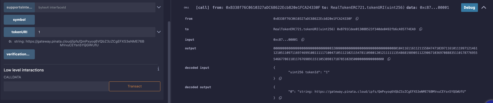

# real-token-blockchain
Repozytorium zawiera aplikację do tokenizacji nieruchomości przy użyciu technologii blockchain.
Projekt działa w oparciu o smart kontrakty napisane w Solidity, wraz ze skryptem w JavaScript,
uruchamianym przez Chainlink Functions w celu przeniesienia danych a API na blockchain.

## Jak zbudowana jest aplikacja

### Tech stack
* Solidity, JavaScript, Ethers.js, Chainlink Functions, IPFS (poprzez [Pinata](https://app.pinata.cloud/auth/signin)),
* Standardy [OpenZeppelin](https://docs.openzeppelin.com) (ERC721, ERC1155, ERC2981 dla Royalties, Ownable, Reentrancy Guard)
* Zewnętrzne API dla danych o nieruchomościach
* [Remix IDE](https://remix.ethereum.org/) - środowisko wykonawcze
* [Arbiscan Sepolia](https://sepolia.arbiscan.io) - eksplorator bloków
  
### Opis
Aplikacja składa się z kilku smart kontraktów napisanych w Solidity, przygotowanych do wdrożenia w sieci Arbitrum Sepolia.  
Projekt nie zawiera frontendu, dlatego konieczne jest testowanie bezpośrednio na blockchainie lub w lokalnej sieci testowej.  
Rekomendowane do testów jest Remix IDE, który pozwala na lokalne wdrożenie kontraktów umożliwiając sprawdzenie ich działania.  
Remix IDE pozwala także na interakcję z blockchainem bezpośrednio z poziomu przeglądarki dzięki podpięciu portfela wirtualnego jak np. Metamask. 
Pozwala również na realne wdrożenie przetestowanych kontraktów do wybranej sieci zapewniając przejrzysty interfejs.  

W celach testowych przygotowane zostały metadane dla 20 tokenów. Do ich przechowywania wykorzystywany jest zdecentralizowany system IPFS (za pośrednictwem serwisu Pinata).  
Odczytane z API dane o nieruchomości w połączeniu z przykładowymi zdjęciami nieruchomości zostały umieszczone w IPFS.  
Plik estateIdToIpfsMap zawiera przyporządkowane do konkretnych estateID hasze umieszczonych w IPFS metadanych.  
Metadane odpowiadają danym przekazywanym przez API dla każdego z 20 estateID, które odczytywane są przez Chainlink Functions z API.

----  
### Wymagania wstępne i aplikacje zewnętrzne
- Własny klucz do API (w tym wypadku [ATTOM](https://api.developer.attomdata.com/))
- Własny klucz do Pinata w celu umieszczenia metadanych w IPFS
- Konto w Chainlink Functions z wpłaconymi tokenami LINK na pokrycie każdorazowego połączenia z API
- Portfel w sieci Ethereum (zalecany Metamask) - aplikacja ma ustawienia dla Arbitrum Sepolia
- Tokeny testowe ETH Sepolia dostępne w sieci Arbitrum Sepolia - [Faucet Alchemy -> 0.1 ETH / 72h](https://www.alchemy.com/faucets/ethereum-sepolia)
  Tokeny testowe uzyskane w faucecie dla sieci Ethereum Sepolia można przesłać do Arbitrum Sepolia używając [Arbitrum Bridge](https://bridge.arbitrum.io/?destinationChain=arbitrum-sepolia&sourceChain=sepolia)

### Smart kontrakty w Solidity
* `VerificationManager.sol` - odpowiedzialny za bezpieczeństwo i weryfikację 
* `ChainlinkConnector.sol` - odpowiada za łączność z API przy pomocy Chainlink Functions, gdzie uruchamiany jest skrypt w JavaScript
* `RealTokenERC721` - Kontrakt do obsługi tokenizacji pojedynczych tokenów dla nieruchomości
* `RealTokenERC1155` - Kontrakt do obsługi tokenizacji w standardzie ERC1155 dla wielu tokenów jednej nieruchomości

### Pliki pomocnicze dla celów demonstracyjnych

* `ApiData.js` - plik, który pobiera dane z API, służące do przeglądania i będące punktem wyjścia dalszych operacji. Odpowiada za utworzenie części plików json oraz metadanych użytych w demonstracyjnych nieruchomościach.
* `ipfsPhotos.js` - mapa z przygotowanymi adresami zdjęć wrzuconych do IPFS (wymagana przez ApiData.js)
  
* `listaNieruchomosci.json` oraz propertiesList.json - pliki zawierające dane o nieruchomościach z API, tworzony przez ApiData.js
* `estateIdToIpfsMap.json` - zawiera 20 estateID z przyporządkowanymi im adresami metadanych umieszczonych w IPFS. Dane potrzebne do przetestowania funkcji tokenizacji (tokenizeProperty())
* `chainlinkTestInput.json` - przetransponowana wersja haszy z estateIdToIpfsMap w formacie bytes, bytes stanowi argument dla funkcji testowej testContract() w ChainlinkConnector.sol

* `chainlinkPlayground.js` - plik zawiera 2 wersje skryptu w JavaScript, który wykonywany jest przez kontrakt ChainlinkConnector.sol - wersję z kontraktu oraz wersje która wypisuje odpowiedź w formacie bytes. Działanie skryptu można przetestować w środowisku testowym [Chainlink Playground](https://functions.chain.link/playground)

---    

## Opis działania programu

#### Weryfikacja nieruchomości i użytkowników  
System weryfikacji użytkowników i nieruchomości realizowany jest przez dedykowany kontrakt `VerificationManager.sol`, który odpowiada za bezpieczeństwo i reguluje dostęp do poszczególnych funkcjonalności,
`VerificationManager` przechowuje listy zweryfikowanych nieruchomości (jako lista estateID), zweryfikowanych użytkowników oraz już stokenizowanych nieruchomości.   

Jedynie portfele użytkowników których adres portfela został zweryfikowany mogą korzystać z dalszych części programu.  
Tylko admin (domyślnie adres który wdraża kontrakt) może weryfikować nowych użytkowników.  

#### Łączność z API i Chainlink Functions  
Aby symulować weryfikację przez podmiot zewnętrzny, lista zweryfikowanych nieruchomości pobierana jest z API, przy użyciu Chainlink Functions (tu przykładowo ATTOM Data API).  
Podczas połączenia z API `ChainlinkConnector.sol` odczytuje aktualne (ostatnio zapisane lub 0 dla pierwszej nieruchomości) estateID,  
czyli unikalny identyfikator nieruchomości i zapisuje go w `VerificationManager`  
Skrypt wykonywany przez Chainlink Functions odczytuje w pętli 20 nieruchomości z pierwszej strony wyników wyświetlanych przez API dla danego kodu pocztowego.  
Połączenie wywołuje funkcja `sendRequest()`, gdzie podać należy ID subskrybcji w Chainlink oraz klucz do API 

#### Dostępne standardy  
* ERC721 - standard dla nieruchomości w relacji 1 do 1 z tokenem 
* ERC1155 - standard dla nieruchomości w relacji: 1 nieruchomość - wiele tokenów

Oba standardy obłsugiwane są przez oparte na podobnej zasadzie działania kontrakty `RealTokenERC721.sol` oraz `RealTokenERC1155`.
Ze względu na pewne róznice techniczne oraz możliwość prezentacji ich obu, standardy rozdzielone są na dwa kontrakty. Mają jednak docelowo to samo przeznaczenie.  
Wedle założeń standard powinien być dobierany przez frontend, odpowiednio do wymagań użytkownika.

#### Tokenizacja nieruchomości  
Tokenizacja jest możliwa tylko gdy: portfel (adres) użytkownika jest zweryfikowany oraz estateID nieruchomości jest zweryfikowane (a nieruchomość nie była jeszcze tokenizowana).  
W funkcji `tokenizePropperty()` podać należy trzy argumenty: 
- estateID nieruchomości, która ma być tokenizowana
- ilość tokenów (zawsze 1 dla ERC721, dowolna dla ERC1155)
- adres ipfs metadanych (znajduje się w pliku `estateIdToIpfsMap.json` dla każdego z 20 estateIDs)

  
#### Pozostałe funkcjonalności  dla istniejących tokenów
- Transfer tokenów (tylko między zweryfikowanymi użytkownikami)
- Sprzedaż tokenów (jak wyżej)
- Obsługa prowizji (Royalties) dzięki implementacji standardu ERC2981 - obsługiwana przez giełdy tokenów NFT

--- 

## Metadane i IPFS

Dostępne w aplkacji metadane stworzone zostały w oparciu o dane pobrane z API. W oparciu one przygotowano metadane wraz ze zdjęciami nieruchomości.  
Na podobnej zasadzie w prawdziwej wersji aplikacji metadane przygotowane powinny być przez jednostkę która obsługuje API.  
Z uwagi na bardzo duży koszt obsługi stringów na blockchainie, metadane powinny zostać podane przez zewnętrzny serwer w backendzie lub frontendzie strony.  
Podobnie jak w aplikacji powinien istnieć zapisany na blockchainie łącznik gwarantujący prawdziwość metadanych dla tokenizowanej nieruchomości.  
Ponieważ prezentowana aplikacja nie ma frontendu, adres metadanych podawany jest ręcznie podczas tokenizacji.  
Wszystkie mechanizmy użyte do ich generowania i obsługi zostały zaprezentowane na przykładowych danych.  

### Dostępność metadanych w IPFS i kompatybilność z giełdami  
Dzięki zapisaniu danych poprzez Pinata, są one łatwo dostępne dzięki użyciu ich hasza. Zapisany jest on w tokenURI.  
Zgodność ze standardem i zapis w URI umożliwia dostęp do metadanych giełdom NFT.  

Aplikacja jest przystosowana do współpracy z OpenSea SDK, a więc biblioteki używanej na frontendzie która umożliwia łatwą implementację funkcji giełdy.  

Przechowywane w metadanych informacje będą zawsze łatwo dostępne poprzez użycie ich hasza. Tak wygląda zawartość metadanych:  

  
Metadane zawierają również link do zdjęcia każdej ze stokenizowanych nieruchomości.   

Metadane można sprawdzić bezpośrednio w kontrakcie lub używając zmiennej tokenURI  w Remix

--- 

## Wdrożenie i działanie aplikacji

1. Przed wdrożeniem należy upewnić się że portfel ma odpowiednią ilość tokenów SepoliaETH
2. Konieczne jest też utworzenie konta w Chainlink Functions oraz zasilenie go testowymi tokenami LINK
3. Korzystając z Remix IDE należy zmienić EVM na 0.8.24
4. Każdy z kontraktów należy najpierw skompilować (Ctrl + S) lub korzystając z menu po lewej - Solidity Compiler i wybrać Compile smartContrat.sol, a na koniec Deploy.
5. Wdrożenie należy rozpocząć od `VerificationManager.sol`
6. Adres kontraktu wyświetlony w Remix lub skopiowany z Metamask należy później podać wszystkim kolejnym kontraktom.
   

7. Kolejnym wdrażanym kontraktem jest `ChainlinkConnector.sol`
8. Po jego wdrożeniu aktywować należy łączność z Chainlink Functions. 
   W tym celu na koncie Chainlink należy dodać klienta (Add consumer) podając adres kontraktu `ChainlinkConnector.sol`
  

9. Po aktywacji klienta można już z poziomu kontraktu wykonać funkcję sendRequest(), która odczytuje estateID ostatniej zweryfikowanej nieruchomości (domyślnie 0)   
   i łączy się z API. Funkcja pobiera z API numer kolejnego estateID i dodaje je do zweryfikowanych nieruchomości, co umożliwia dalsze czynności.
10. Następnie warto zweryfikować adres admina, który domyślnie nie jest zweryfikowanym użytkownikiem.  
   Umożliwi to korzystanie z pozostałych funkcjonalności, które dostępne są tylko po weryfikacji.
11. Na koniec warto zostawić wdrożenie dwóch ostatnich kontraktów odpowiedzialnych za tokenizację: 
   `RealTokenERC721` i `RealTokenERC1155`
12. Aplikacja jest aktywna po wykonaniu powyższych kroków i można przejść do jej używania. Można przejść do tokenizacji nieruchomości i czynności z tym powiązanych.

---

### Ponowne uruchomienie aplikacji 
Środowisko Remix IDE umożliwia ponowne wgranie umieszczonych na blockchainie smart kontraktów.
Aby odtworzyć środowisko należy wczytać pliki do Remix IDE (muszą być w takim samym stanie jak podczas wdrożenia).
Zamiast "Deploy" należy odtworzyć kontrakt używając "At Address" podając adres poprzednio wdrożonych kontraktów.

